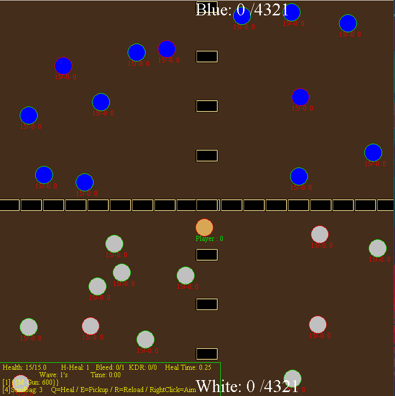

# WarBalls
Java Applet built using the MVC design pattern

The Code was based on the Model View Controller Design Pattern.

Using this pattern made it easy to seperate the program 
into a series of seperate Java classes each of which was dedicated to a particular aspect of the program.

The main Controller houses both the game logic and the interaction choices of the enemy bots.
Here is the gameplay footage which shows the very interesting results.

